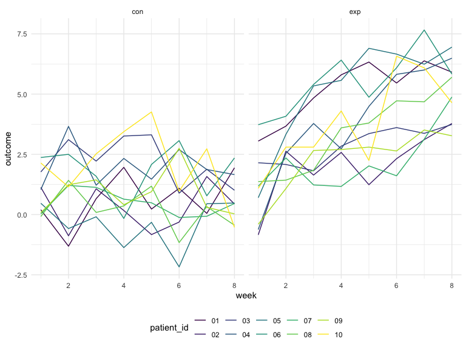

Homework 5
================
RuiJun Chen
11/11/2019

## Problem 1

``` r
set.seed(10)

iris_with_missing = iris %>% 
  map_df(~replace(.x, sample(1:150, 20), NA)) %>%
  mutate(Species = as.character(Species))

iris_with_missing = iris_with_missing %>% janitor::clean_names()

fill_missing = function(x) {
  if (is.numeric(x)) {
    x = x %>% replace_na(mean(x, na.rm = TRUE))
  } else if (is.character(x)) {
    x = x %>% replace_na("virginica")
  } else {
    stop("x is neither numeric nor a character")
  }
}

iris_filled =
  map(iris_with_missing, fill_missing) %>% 
  bind_rows()

iris_filled
```

    ## # A tibble: 150 x 5
    ##    sepal_length sepal_width petal_length petal_width species
    ##           <dbl>       <dbl>        <dbl>       <dbl> <chr>  
    ##  1         5.1          3.5         1.4         0.2  setosa 
    ##  2         4.9          3           1.4         0.2  setosa 
    ##  3         4.7          3.2         1.3         0.2  setosa 
    ##  4         4.6          3.1         1.5         1.19 setosa 
    ##  5         5            3.6         1.4         0.2  setosa 
    ##  6         5.4          3.9         1.7         0.4  setosa 
    ##  7         5.82         3.4         1.4         0.3  setosa 
    ##  8         5            3.4         1.5         0.2  setosa 
    ##  9         4.4          2.9         1.4         0.2  setosa 
    ## 10         4.9          3.1         3.77        0.1  setosa 
    ## # … with 140 more rows

## Problem 2

``` r
study_pts = 
  list.files(path = "./data") %>% 
  enframe(name = NULL, value = "path") %>% 
  mutate(        #read in every CSV using map after appending ./data/ to get correct path
    path = str_c("./data/",path),
    data = map(path, read_csv, col_types = "dddddddd")
  ) %>% 
  unnest(data) %>%    #un-nest all weeks of data
  mutate(     #extract patient ID and experiment arm
    patient_id = substr(path, 12, 13),
    arm = substr(path, 8, 10)
  ) %>% 
  select(-path) %>% 
  pivot_longer(     #makes data more tidy for analysis
    week_1:week_8,
    names_to = "week",
    values_to = "outcome"
  ) %>% 
  mutate(
    week = as.numeric(substr(week, 6,6))
  )

study_pts
```

    ## # A tibble: 160 x 4
    ##    patient_id arm    week outcome
    ##    <chr>      <chr> <dbl>   <dbl>
    ##  1 01         con       1    0.2 
    ##  2 01         con       2   -1.31
    ##  3 01         con       3    0.66
    ##  4 01         con       4    1.96
    ##  5 01         con       5    0.23
    ##  6 01         con       6    1.09
    ##  7 01         con       7    0.05
    ##  8 01         con       8    1.94
    ##  9 02         con       1    1.13
    ## 10 02         con       2   -0.88
    ## # … with 150 more rows

``` r
study_pts %>% 
  ggplot(aes(x = week, y = outcome, color = patient_id)) +
  geom_line() +
  facet_grid(~arm)
```



For whatever the outcome is, the patients in the experimental arm seem
to have increasing values over time, a positive correlation with the
experimental exposure over time. The control arm appears to have
slightly lower values at baseline and have no clear correlation (or
slightly negative correlation) over time.

## Problem 3
